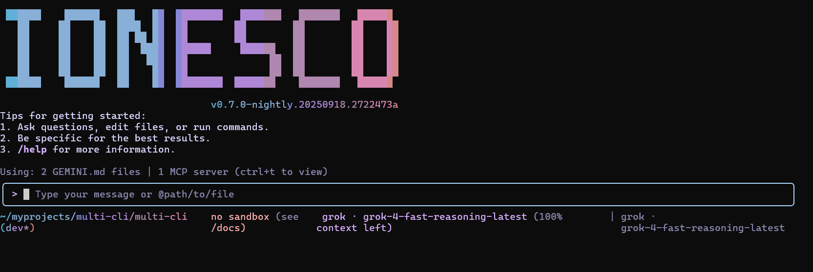

# Ionesco CLI

[](https://github.com/google-gemini/gemini-cli/actions/workflows/ci.yml)
[](https://github.com/google-gemini/gemini-cli/actions/workflows/e2e.yml)
[](https://github.com/google-gemini/gemini-cli/blob/main/LICENSE)



Ionesco CLI is an open-source AI agent that brings the power of Gemini directly into your terminal. It provides lightweight access to Gemini, giving you the most direct path from your prompt to our model.

## 🚀 Why Ionesco CLI?

- **🎯 Free tier**: 60 requests/min and 1,000 requests/day with personal Google account
- **🧠 Powerful Gemini 2.5 Pro**: Access to 1M token context window
- **🔧 Built-in tools**: Google Search grounding, file operations, shell commands, web fetching
- **🔌 Extensible**: MCP (Model Context Protocol) support for custom integrations
- **💻 Terminal-first**: Designed for developers who live in the command line
- **🛡️ Open source**: Apache 2.0 licensed

## Attribution

Ionesco CLI builds on the open-source [Gemini CLI](https://github.com/google-gemini/gemini-cli) project from Google LLC and remains distributed under the Apache License 2.0. All original LICENSE terms and copyright notices are preserved in this repository.

## 📦 Installation

### System Requirements

- Node.js version 20 or higher
- macOS, Linux, or Windows

## Provider Setup

### Google Gemini

The default configuration continues to use Google's Gemini models. Configure API keys and authentication as described in [docs/cli/authentication.md](./docs/cli/authentication.md).

### Grok (xAI)

Ionesco CLI ships with an experimental Grok provider backed by the Python sidecar under `providers/grok_sidecar/`.

1. Run `./setup.sh` (or `scripts\setup.bat` on Windows) to create the sidecar virtualenv and install dependencies.
2. Copy `providers/grok_sidecar/.env.example` to `.env` and add:
   ```bash
   GROK_API_KEY=your_api_key
   GROK_MODEL=your_preferred_model_id   # optional; defaults to grok-4-fast-reasoning-latest
   ```
3. Launch the CLI (`./start.sh` or `scripts\start.bat`).
4. Switch providers inside the session:
   ```
   /agent list          # show available providers
   /agent use grok      # activate Grok provider
   ```

When a provider is active, the footer and summary panels show the provider and model names.

## 📋 Key Features

### Code Understanding & Generation

- Query and edit large codebases
- Generate new apps from PDFs, images, or sketches using multimodal capabilities
- Debug issues and troubleshoot with natural language

### Automation & Integration

- Automate operational tasks like querying pull requests or handling complex rebases
- Use MCP servers to connect new capabilities, including [media generation with Imagen, Veo or Lyria](https://github.com/GoogleCloudPlatform/vertex-ai-creative-studio/tree/main/experiments/mcp-genmedia)
- Run non-interactively in scripts for workflow automation

### Advanced Capabilities

- Ground your queries with built-in [Google Search](https://ai.google.dev/gemini-api/docs/grounding) for real-time information
- Conversation checkpointing to save and resume complex sessions
- Custom context files (GEMINI.md) to tailor behavior for your projects

## 🔐 Authentication Options

Choose the authentication method that best fits your needs:

### Option 1: Login with Google (OAuth login using your Google Account)

**✨ Best for:** Individual developers as well as anyone who has a Gemini Code Assist License. (see [quota limits and terms of service](https://cloud.google.com/gemini/docs/quotas) for details)

**Benefits:**

- **Free tier**: 60 requests/min and 1,000 requests/day
- **Gemini 2.5 Pro** with 1M token context window
- **No API key management** - just sign in with your Google account
- **Automatic updates** to latest models

#### Start Ionesco CLI, then choose _Login with Google_ and follow the browser authentication flow when prompted

```bash
./start.sh
```

#### If you are using a paid Code Assist License from your organization, remember to set the Google Cloud Project

```bash
# Set your Google Cloud Project
export GOOGLE_CLOUD_PROJECT="YOUR_PROJECT_NAME"
./start.sh
```

### Option 2: Gemini API Key

**✨ Best for:** Developers who need specific model control or paid tier access

**Benefits:**

- **Free tier**: 100 requests/day with Gemini 2.5 Pro
- **Model selection**: Choose specific Gemini models
- **Usage-based billing**: Upgrade for higher limits when needed

```bash
# Get your key from https://aistudio.google.com/apikey
export GEMINI_API_KEY="YOUR_API_KEY"
./start.sh
```

### Option 3: Vertex AI

**✨ Best for:** Enterprise teams and production workloads

**Benefits:**

- **Enterprise features**: Advanced security and compliance
- **Scalable**: Higher rate limits with billing account
- **Integration**: Works with existing Google Cloud infrastructure

```bash
# Get your key from Google Cloud Console
export GOOGLE_API_KEY="YOUR_API_KEY"
export GOOGLE_GENAI_USE_VERTEXAI=true
./start.sh
```

For Google Workspace accounts and other authentication methods, see the [authentication guide](./docs/cli/authentication.md).

## 🚀 Getting Started

### Project Setup

```bash
# Clone this repository (replace with your fork URL)
git clone https://github.com/your-org/ionesco-cli.git
cd ionesco-cli

# Install Node dependencies and prime the Grok sidecar
npm install
./setup.sh

# Launch the CLI (use scripts\start.bat on Windows)
./start.sh
```

> Tip: run `./scripts/create_alias.sh` to expose a `gemini` shell alias for
> compatibility with existing workflows.

### Basic Usage

#### Start in current directory

```bash
./start.sh
```

#### Include multiple directories

```bash
npm run start -- --include-directories ../lib,../docs
```

> Use `npm run start -- --help` to view all command-line options. The double dash (`--`) ensures arguments are forwarded to the CLI entrypoint.

#### Use specific model

```bash
npm run start -- --model gemini-2.5-flash
```

#### Non-interactive mode for scripts

Get a simple text response:

```bash
npm run start -- --prompt "Explain the architecture of this codebase"
```

For more advanced scripting, including how to parse JSON and handle errors, use
the `--output-format json` flag to get structured output:

```bash
npm run start -- --prompt "Explain the architecture of this codebase" --output-format json
```

Inside the running session, `/agent list` shows available providers and `/agent use <providerId>` switches between them (for example `/agent use grok`).

### Quick Examples

#### Start a new project

```bash
cd new-project/
./start.sh
> Write me a Discord bot that answers questions using a FAQ.md file I will provide
```

#### Analyze existing code

```bash
git clone https://github.com/your-org/ionesco-cli.git
cd ionesco-cli
./start.sh
> Give me a summary of all of the changes that went in yesterday
```

## 📚 Documentation

### Getting Started

- [**Quickstart Guide**](./docs/cli/index.md) - Get up and running quickly
- [**Authentication Setup**](./docs/cli/authentication.md) - Detailed auth configuration
- [**Configuration Guide**](./docs/cli/configuration.md) - Settings and customization
- [**Keyboard Shortcuts**](./docs/keyboard-shortcuts.md) - Productivity tips

### Core Features

- [**Commands Reference**](./docs/cli/commands.md) - All slash commands (`/help`, `/chat`, `/mcp`, etc.)
- [**Checkpointing**](./docs/checkpointing.md) - Save and resume conversations
- [**Memory Management**](./docs/tools/memory.md) - Using GEMINI.md context files
- [**Token Caching**](./docs/cli/token-caching.md) - Optimize token usage

### Tools & Extensions

- [**Built-in Tools Overview**](./docs/tools/index.md)
  - [File System Operations](./docs/tools/file-system.md)
  - [Shell Commands](./docs/tools/shell.md)
  - [Web Fetch & Search](./docs/tools/web-fetch.md)
  - [Multi-file Operations](./docs/tools/multi-file.md)
- [**MCP Server Integration**](./docs/tools/mcp-server.md) - Extend with custom tools
- [**Custom Extensions**](./docs/extension.md) - Build your own commands

### Advanced Topics

- [**Architecture Overview**](./docs/architecture.md) - How Ionesco CLI works
- [**IDE Integration**](./docs/ide-integration.md) - VS Code companion
- [**Sandboxing & Security**](./docs/sandbox.md) - Safe execution environments
- [**Enterprise Deployment**](./docs/deployment.md) - Docker, system-wide config
- [**Telemetry & Monitoring**](./docs/telemetry.md) - Usage tracking
- [**Tools API Development**](./docs/core/tools-api.md) - Create custom tools

### Configuration & Customization

- [**Settings Reference**](./docs/cli/configuration.md) - All configuration options
- [**Theme Customization**](./docs/cli/themes.md) - Visual customization
- [**.ionesco Directory**](./docs/gemini-ignore.md) - Project-specific settings
- [**Environment Variables**](./docs/cli/configuration.md#environment-variables)

### Troubleshooting & Support

- [**Troubleshooting Guide**](./docs/troubleshooting.md) - Common issues and solutions
- [**FAQ**](./docs/troubleshooting.md#frequently-asked-questions) - Quick answers
- Use `/bug` command to report issues directly from the CLI

### Using MCP Servers

Configure MCP servers in `~/.ionesco/settings.json` to extend Ionesco CLI with custom tools:

```text
> @github List my open pull requests
> @slack Send a summary of today's commits to #dev channel
> @database Run a query to find inactive users
```

See the [MCP Server Integration guide](./docs/tools/mcp-server.md) for setup instructions.

## 🤝 Contributing

We welcome contributions! Ionesco CLI is fully open source (Apache 2.0), and we encourage the community to:

- Report bugs and suggest features
- Improve documentation
- Submit code improvements
- Share your MCP servers and extensions

See our [Contributing Guide](./CONTRIBUTING.md) for development setup, coding standards, and how to submit pull requests.

Check our [Official Roadmap](https://github.com/orgs/google-gemini/projects/11/) for planned features and priorities.

## 📖 Resources

- **[Official Roadmap](./ROADMAP.md)** - See what's coming next
- **Upstream Project:** [Gemini CLI](https://github.com/google-gemini/gemini-cli) for historical releases and issue tracking
- **Issue Tracker:** [your-org/ionesco-cli](https://github.com/your-org/ionesco-cli/issues)
- **Sidecar Docs:** [Grok Provider README](./providers/grok_sidecar/README.md)

### Uninstall

See the [Uninstall Guide](docs/Uninstall.md) for removal instructions.

## 📄 Legal

- **License**: [Apache License 2.0](LICENSE)
- **Terms of Service**: [Terms & Privacy](./docs/tos-privacy.md)
- **Security**: [Security Policy](SECURITY.md)

---

<p align="center">
  Built with ❤️ by Google and the open source community
</p>
